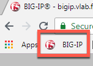
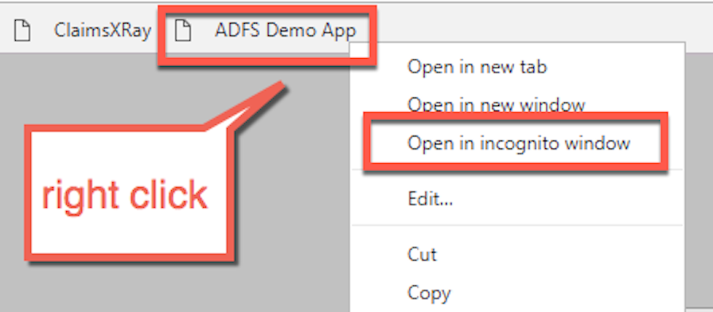

Module: Connect and Validate Environment
========================================

In this module you will validate that ADFS and the application that
requests ADFS authentication are functioning without the BIG-IP in the
traffic flow.

Open an RDP session to the client machine
-----------------------------------------

1. Open an RDP session to the client jumphost

2. Login with username: user and password: user

Change Client to Point at ADFS-1 Direct (BIG-IP not in traffic flow)
--------------------------------------------------------------------

1. Double click the “ADFS-1 Direct” desktop shortcut

|image2|

2. You should receive a notification that the HOSTS file now points
   adfs.vlab.f5demo.com directly at the ADFS-1 server.

|image3|

Verify ADFS and App are Functional
----------------------------------

1. Close any open Chrome windows

2. Open a new Chrome window

3. Click the “ADFS Demo App” shortcut

|image4|

4. You should see a set of claims displayed in the claims app at
   app.vlab.f5demo.com

|image5|

a. Note that ADFS identified the user as inside the corporate network
   because they did not go through an MS-ADFSPIP compliant proxy.

b. What happened:

   i.   You made a request to App

   ii.  App redirected you to ADFS for authentication

   iii. ADFS authenticated you automatically with Windows Integrated
        Authentication with your domain joined computer

   iv.  ADFS redirected you back to App with a WS-Fed assertion

   v.   App validated the assertion and displayed the claims it received
        from ADFS

1. If you do not see claims then the virtual environment may not have
   started correctly. It must be fixed before proceeding, please see a
   lab assistant.

.. |image3| image:: media/image4.png
   :width: 2.84259in
   :height: 0.94358in
.. |image4| image:: media/image5.png
   :width: 2.48148in
   :height: 0.92839in
.. |image5| image:: media/image6.png
   :width: 4.49074in
   :height: 1.75408in
